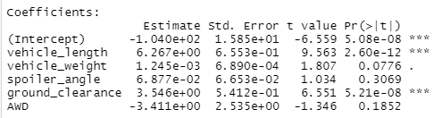
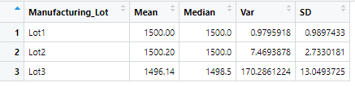

# MechaCar_Statistical_Analysis
## Linear Regression to Predict MPG

### Which variables/coefficients provided a non-random amount of variance to the mpg values in the dataset?
The vehicle length and spoiler angle have the variable that will have a non-random amount of variance to the mpg values because the lower p-values indicate the outcome to be very unlikely. 

### Is the slope of the linear model considered to be zero? Why or why not?
The slope is the linear model is not zero because the small p-value strong evidence against the null hypothesis.
### Does this linear model predict mpg of MechaCar prototypes effectively? Why or why not?
The r-squared value means that about 72% of the predictions will be effective against mpg. 

## Summary Statistics on Suspension Coils

### The design specifications for the MechaCar suspension coils dictate that the variance of the suspension coils must not exceed 100 pounds per square inch. Does the current manufacturing data meet this design specification for all manufacturing lots in total and each lot individually? Why or why not?

Lot 1 and 2 are within that 100 pounds per square inch variance, however lot 3 doesn't being over 100 at 170.29. 
