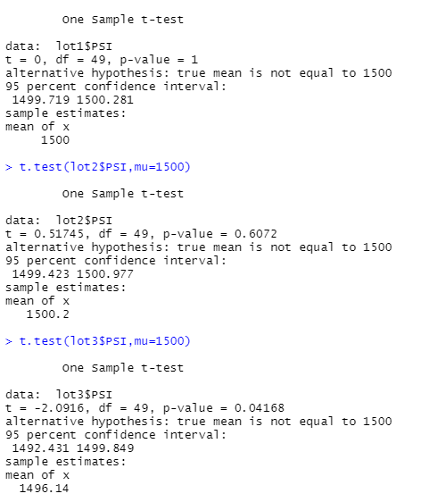
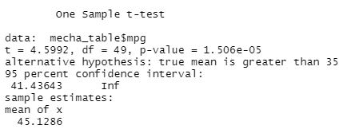

# MechaCar Statistical Analysis
## Linear Regression to Predict MPG

### Which variables/coefficients provided a non-random amount of variance to the mpg values in the dataset?
The vehicle length and spoiler angle have the variable that will have a non-random amount of variance to the mpg values because the lower p-values indicate the outcome to be very unlikely. 

### Is the slope of the linear model considered to be zero? Why or why not?
The slope is the linear model is not zero because the small p-value strong evidence against the null hypothesis.
### Does this linear model predict mpg of MechaCar prototypes effectively? Why or why not?
The r-squared value means that about 72% of the predictions will be effective against mpg. 

## Summary Statistics on Suspension Coils

### The design specifications for the MechaCar suspension coils dictate that the variance of the suspension coils must not exceed 100 pounds per square inch. Does the current manufacturing data meet this design specification for all manufacturing lots in total and each lot individually? Why or why not?

Lot 1 and 2 are within that 100 pounds per square inch variance, however lot 3 doesn't being over 100 at 170.29. 

## T-Tests on Suspension Coils

### Here is the summary of the t-test for each lot. 
As you see Lot 1 and 2 have p-value greater than 0.05 therefore we can fail to reject the null hypothesis that each lot individually are statistically different from the population mean of 1,500 pounds per square inch
However in lot 3 the p-value is less than 0.05 so we can reject the null hypothesis. 

## Study Design: MechaCar vs Competition
### What metric or metrics are you going to test?
We are going to test the mpg agaisnt the competition. 
### What is the null hypothesis or alternative hypothesis?
Null Hypothesis is MechaCar is not greater than 35 miles per gallon. 

Alternative Hypothesis is the MechaCar is greater than 35 miles per gallon. 
### What statistical test would you use to test the hypothesis? And why?
We are going use use a t-test to evaluate. 
### What data is needed to run the statistical test?
Mpg sample data is needed to run the statistical test. 
### Results 

The p-value is less than 0.05 so we can say we have 95% confidence than our MechaCar is greater than and performs better against the competition at 35 mpg. 
